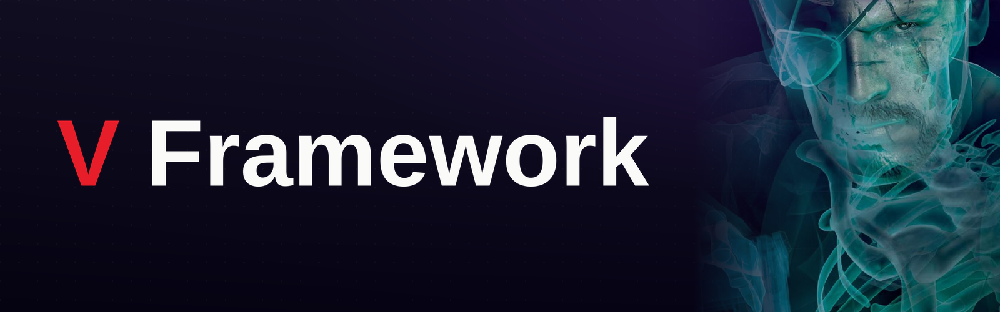

<p align="center">
  
</p>

# V_Framework

V_Framework is a DLL that loads into the running game, installs function-entry hooks across the FoxEngine via [MinHook](https://github.com/TsudaKageyu/minhook), and exposes the hooked behavior to game-side Lua through a set of custom native libraries. It is built to sit on top of **Infinite Heaven**.
---

## Supported game builds

V_Framework reads `version_info.txt`, that's how it can tell which version the game is, If the file is missing or unrecognized it falls back to **EN 1.0.15.4**.

| Build | Internal tag | `version_info.txt` markers |
|-------|--------------|----------------------------|
| English 1.0.15.4 (current) | `day3800` | default |
| Japanese 1.0.15.4 | `day3800` | contains `mst_jp` |
| English 1.0.15.3 | `day1820` | contains `day1820` |
| Japanese 1.0.15.3 | `day1820` | contains `day1820` + `mst_jp` |

Addresses are hardcoded per build.

---
### State persistence

`V_FrameWorkState` is located in GameDir/mod/V_FrameWork, it basiclly is V Framework's save file, and it's currently used only for custom cassette tapes.

---

## Lua API

### Native libraries (registered by the DLL)

| Library | Area |
|---------|------|
| `V_FrameWork` | Core — logging.
| `V_TppUiCommand` | UI commands — mission icons, MB device announce popups, change-location menu |
| `V_TppSoundDaemon` | Sound daemon control |
| `V_CassetteCommand` | Cassette commands such as play/pause/resume...etc/ custom-tape registration and also linking to a radio.|
| `V_Sahelan` | Sahelanthropus — FOVA face assets, eye-lamp / heart-light color |
| `V_Player` | Player voice FPK overrides per player type |
| `V_Fox` | FoxEngine utilities (hashing, game-object access) |
| `V_Helicopter` | Support-helicopter voice / radio / field-taxi |
| `V_TppMotherBaseManagement` | Mother Base management hooks |

### Lua wrappers (`guide/`)

The `guide/` Lua files are lua wrappers that modders can safely, it does all sorts of checks to make sure the call goes smoothly.

---

## Building

Requirements:

- Visual Studio 2022 or 2026 (toolset **v143** or **v145**)
- Windows SDK 10
- C++17

Open `V_FrameWork.sln`, select **Release | x64**, and build. Output is `V_FrameWork.dll`. MinHook and the Lua 5.1 headers are vendored under `lib/` and `include/`, so there's nothing else to fetch. (Win32 configurations exist in the project but the game is 64-bit; build x64.)

---

## Installing

> The repository ships no injector or loader. V_Framework is consumed as a native Lua extension under an Infinite Heaven setup.

1. Build `V_FrameWork.dll`.
2. Place the .dll next to the game's .exe.
3. The most important part, `V_FrameWork_Core.lua`, place it in mod/modules.
4. Packed assets are referenced from Lua as `/Assets/tpp/pack/V_FrameWork/...fpk` (you can download V Framework on nexus and take them from there.
5. Ensure `version_info.txt` in the module directory identifies your build (see the table above) so the correct address set is selected.
---

## Writing a mod

An example of adding a brand new custom cassette tape!
```lua
local this = {}

function this.LoadLibraries()
    V_TppCassette.RegisterCustomCassetteAlbum(
        { albumId = "GZ_bgm_03", langId = "GZ_bgm_03", type = "PREINSTALL_MUSIC" },
        {
            {
                langId     = "GZ_tp_bgm_03_01",
                fileName   = "GZ_tp_bgm_03_01",
                dataTimeEn = 188e3,
                dataTimeJp = 188e3,
                important  = 0,
                special    = 0,
                unlocked   = 1,
            },
        }
    )
end

return this
```
---

## Third-party

- [MinHook](https://github.com/TsudaKageyu/minhook) — function-entry hooking library (vendored).
- Lua 5.1 — headers for the FoxEngine's embedded Lua (vendored).
